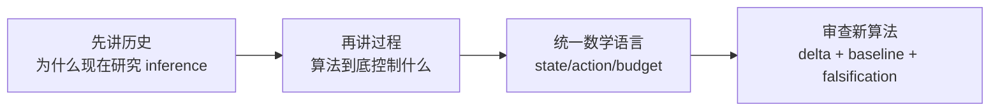

# DLM Briefings

这里存放可以直接用于交流、白板讨论和汇报的材料。论据回链到 `reference/`，想法判断回链到 `paper/legacy/ideas/`。

| 页面 | 适用场景 | 建议时间 |
|---|---|---:|
| [[research/dlm/paper/legacy/history-and-landscape]] | 用一张历史图说明领域从哪里来、现在竞争在哪里 | 5 分钟 |
| [[research/dlm/paper/legacy/diffusion-process-visual]] | 向非 NLP 同学解释三种 diffusion 与 masked DLM 反演过程 | 10 分钟 |
| [[research/dlm/paper/legacy/math-or-discussion]] | 和数学/运筹同学共同形式化“更好的算法” | 30-45 分钟 |
| [[research/dlm/paper/legacy/presentation-outline]] | 组织一次 15 分钟组会或同学汇报 | 15 分钟 |
| [[research/dlm/paper/legacy/render-check-2026-07-16]] | Mermaid 图渲染校验记录与截图 | 2 分钟 |

## PDF Handout

| File | 用法 |
|---|---|
| `dlm-foundation-for-optimization.pdf` | 和数学/运筹同学开会前先读的共同基础稿 |
| `dlm-foundation-for-optimization.tex` | 可继续改 TikZ 图和数学定义的 LaTeX 源文件 |

## 推荐组合

返回 [[research/dlm/index]]。
