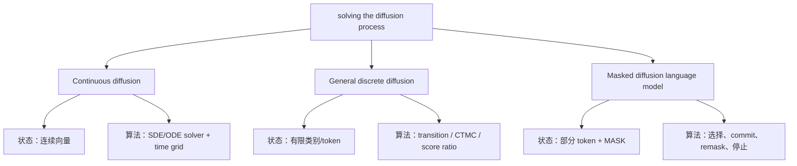
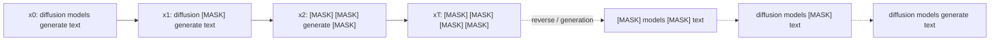
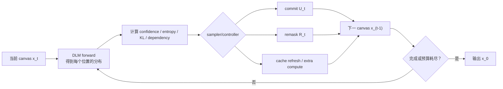
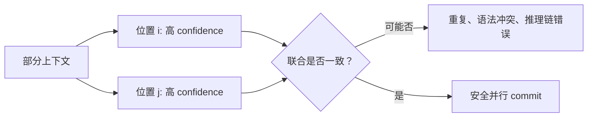

# Diffusion Process Visual Primer

## 先区分三种“解 diffusion”



continuous diffusion 主要问“积分怎么算得更准、更少步”；masked DLM 主要问“每次 forward 后该对哪些离散位置采取什么动作”。两者可以互相借思想，但不是同一个优化问题。

## Forward 与 Reverse

训练时的 forward process 把干净文本逐渐替换成 mask；生成时的 reverse process 从 mask canvas 恢复文本。



在 absorbing-mask 模型中，可把单个位置的 forward corruption 直观理解为：随时间增大，token 留在原值的概率下降，进入 `[MASK]` 后不再回到普通 token。模型学习的是给定部分被 mask 的 canvas 时，对原 token 的条件分布。

## 一次反演迭代到底做什么



最小状态与动作可以写成：

```text
state  s_t = (x_t, masked set M_t, model scores,
              history, dependency signal, cache state, budget b_t)

action a_t = (commit set U_t, remask set R_t,
              compute/cache mode, stop)
```

## 为什么不能一次把所有 token 都填上

并行预测通常近似为各位置独立，但真实文本 token 彼此依赖。两个位置各自都高 confidence，不代表它们同时 commit 后仍然兼容。



这就是 DUS、ADAS、CLAD 等方法研究 spacing、attention 或 cluster dependence 的原因，也是简单 top-k confidence 的结构性局限。

## 与运筹优化的最短连接

在固定 forward-call 预算 `B` 下，可以写成：

```text
maximize_pi  E[terminal quality(x_0)]
subject to   sum_t model_evaluations_t <= B
             x_0 contains no MASK
```

如果目标是服务 SLO，则更自然的是：

```text
minimize_pi  E[latency]
subject to   E[task loss] <= epsilon
             P(latency > SLO) <= delta
```

难点不在写出目标，而在于 terminal quality 很晚才知道、动作是组合子集、token 之间耦合，而且 controller 本身也消耗时间。

下一步：[[research/dlm/paper/legacy/math-or-discussion]]、[[research/dlm/reference/optimization-bridge]]。
