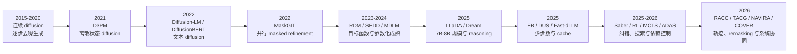
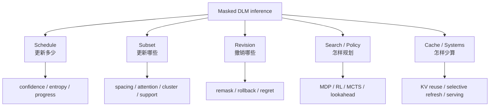

# DLM History and Landscape Visual

## 一张图看历史主线

## 研究重心怎样迁移

| 阶段 | 中心问题 | 典型数学对象 | 对当前项目的意义 |
|---|---|---|---|
| 连续 diffusion | 怎样逆转连续加噪过程 | SDE、probability-flow ODE、数值积分 | 提供 adaptive step 与 local error 思想 |
| 离散 diffusion | 怎样在 token/category 上定义可训练的 Markov 过程 | transition matrix、CTMC、ratio/score | 给出离散生成的概率基础 |
| masked DLM | 怎样从全 mask 并行恢复文本 | absorbing state、masked likelihood | 把 sampler 暴露成 token 更新接口 |
| 大规模 DLM | 能否完成 instruction、reasoning、code | scaling、post-training、variable length | 让推理效率成为真实瓶颈 |
| inference frontier | 哪些 token 何时 commit、何时撤销、做几次 forward | subset selection、MDP、search、stopping | 与运筹/优化同学最直接的交叉点 |
| systems frontier | cache、revision、kernel 与 tail latency 怎样协同 | online control、resource allocation、SLO | 决定算法加速是否真实成立 |

## 当前方法版图

## 到 2026 年的判断

领域已经从“DLM 能否生成文本”进入“如何控制反演轨迹并实现真实系统收益”。因此，一个数学上好看的新优化器还不够；它必须改变可观测信息、带来新保证，或解决现有方法在 domain shift、sequence failure 或 p95 latency 上的明确失效。

进一步阅读：[[research/dlm/reference/landscape]]、[[research/dlm/reference/reading-list]]。

