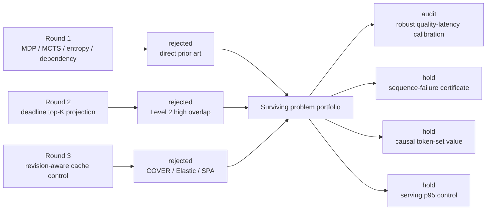

# DLM Optimization Ideas and Evaluation Ledger

This is the single source of truth for ideas in this area. An idea is not promoted to `live` until it has a concrete mechanism, closest-prior comparison, minimal falsification experiment, and explicit compute budget.

返回 [[research/dlm/index]]。文献事实见 [[research/dlm/reference/index]]，交流稿见 [[research/dlm/paper/legacy/index]]。

## Folder Guide

| Folder | Role |
|---|---|
| [[research/dlm/paper/legacy/ideas/index]] | Human-maintained idea ledger and current verdicts |
| [[research/dlm/paper/legacy/ideas/audits/index]] | Independent novelty/scoop checks and rejection logic |
| [[research/dlm/paper/legacy/ideas/runs/index]] | Generated IdeaSpark run artifacts and provenance |

## 当前状态图



## Status Vocabulary

- `rejected`: a close paper already covers the mechanism or the claim is not falsifiable.
- `hold`: a potentially useful direction whose novelty delta is not yet defensible.
- `audit`: a concrete candidate undergoing prior-art comparison.
- `live`: passed the current collision audit and is ready for a small experiment.
- `killed`: failed its stated falsification test.

## Round 1: Literature-Driven Elimination

| Candidate | Initial attraction | Closest collision | Verdict | Reason |
|---|---|---|---|---|
| Formulate DLM unmasking as an MDP and learn a policy | Natural sequential-decision framing | Learning Unmasking Policies; SPG | rejected | The MDP/RL formulation and lightweight learned policy are already explicit prior art |
| Use MCTS to search unmasking orders | Directly handles combinatorial trajectories | MEDAL | rejected | MEDAL searches high-confidence unmasking trajectories with MCTS |
| Optimize a fixed error/entropy budget per step | Clean constrained-optimization story | EB-Sampler | rejected | EB-Sampler already selects both which and how many tokens under an entropy-derived error tolerance |
| Select a dependency-compatible token subset | Looks like set packing/submodular selection | DUS, ADAS, CLAD, dependency-guided decoding | rejected | Spatial separation, soft attention penalties, cluster conflicts, and dependency graphs are all occupied |
| Dynamically unmask more tokens as context improves and remask mistakes | Intuitive receding-horizon controller | Saber; RDD | rejected | Adaptive acceleration plus confidence-drop backtracking and reversible block decoding already exist |
| Use short-horizon rollout/value of information to select reveals | Optimizes future decodability rather than current confidence | LookUM, MEDAL, AXON | rejected | Lookahead paths, tree search, and supportive-token revealing cover the basic mechanism |
| Jointly choose block size and merge multiple trajectories | Multi-granularity hedge against bad schedules | BlockBatch | rejected | Online multi-block-size branching and consensus is already proposed |

Negative results are retained because these are the most likely ideas to be rediscovered from first principles.

## Round 2: Residual Directions

These are problem statements, not novelty claims.

| Direction | Why it may remain open | Main threat | Status |
|---|---|---|---|
| Robust per-request quality-latency calibration across model/task/length shift | Learned policies report out-of-domain degradation; hand thresholds are task-sensitive | Progress-aware schedules, learned policies, Predict-then-Diffuse | hold |
| Tail-latency-constrained joint control of updates, revisions, and cache refresh | Current papers usually optimize mean NFE or one lever; remasking can invalidate caches and inflate p95 | dInfer, Fast-dLLM, Saber, BlockBatch | hold |
| A causal marginal-value estimator for token sets | Attention, confidence, entropy, and KL are proxies; ADAS explicitly notes attention is imperfect | ADAS, DAPD, AXON | hold |
| Correctness-aware sampler/cache co-design under revision | Acceleration survey identifies cache validity under token revisions as open | dKV-Cache, Elastic-Cache, COVER, SPA-Cache | rejected at obvious mechanism level |
| Instance-adaptive budget allocation with a sequence-failure certificate | Theory separates perplexity from sequence error; current confidence signals may not certify correctness | EB-Sampler, theoretical limits, early exit methods | hold |

## IdeaSpark Round 1: Rejected

**Candidate:** Deadline-Conditioned Mask-Flow Control for Diffusion Language Models.

The candidate proposed a completion envelope plus one common score for commit, repair, and no-commit probe actions. It was rejected before expansion.

| Check | Finding |
|---|---|
| Coherence dry run | The one-call probe had no same-state ordinary-time reference after a mask transition; cached logits came from the previous state |
| Model interface | The [official LLaDA repository](https://github.com/ML-GSAI/LLaDA) states that the Transformer does not require timestep `t` as input, so an identical sequence at an "adjacent schedule index" cannot supply the proposed signal on the main baseline |
| Pattern audit | C11 hard floor: `Q_b` substituted a new selection heuristic without a theorem explaining when or why it beats the prior selector |
| Recipe audit | C23, C20, and C11 tactical moves were all bypassed; the draft enacted only their parent-level themes |
| Closest competitor | Saber remained the direct adaptive commit/repair baseline, and the invalid probe did not create a defensible delta |

The full failed attempt is preserved under `paper/legacy/ideas/runs/budgeted-decoding/attempt_1/`. This idea must not be revived by changing the name of the score or by adding another heuristic term.

## IdeaSpark Round 2: Rejected After Independent Scoop Check

**Candidate:** Deadline Paths for Training-Free Masked Diffusion Decoding.

The candidate used one budget-indexed top-`K_b` projection across masked and committed positions. It would keep exactly `K_b` positions committed after each call, thereby combining new commitments and remasking without an extra forward pass.

The internal IdeaSpark audit advanced it because no retrieved 41-paper frontier entry disclosed that exact one-projection formula. The independent scoop check then added the canonical iterative-masking ancestors that the keyword retrieval missed and reversed the decision.

| Closest work | Blocking overlap |
|---|---|
| Mask-Predict (2019) | Predetermined `T`; at each iteration remask the scheduled number of lowest-confidence positions, including positions predicted in earlier iterations |
| MaskGIT (2022) | Fixed `T`; predict in parallel, keep the most confident tokens, and remask the rest to a progress-indexed cardinality |
| Saber (2025) | Training-free adaptive commitment plus re-evaluation and backtracking remasking in DLMs |
| WINO / Confidence Remasking (2026) | Re-score committed positions, remask weak ones, and cap remasks to preserve net progress |
| RACC / TACG / NAVIRA (2026) | Confidence trajectories, budget-capped commitment, and full-set top-k remasking already occupy the remaining ingredients |

**Verdict:** Level 2 - High Overlap. The only remaining axis is using one fixed-cardinality cross-status ranking instead of separate commit and repair controls. That is a useful baseline, not a defensible headline contribution. See [[research/dlm/paper/legacy/ideas/audits/deadline-paths-2026-07-15/report]].

## Round 3: Sampler/Cache Co-Design Collision

**Candidate direction:** use revision-aware dependency information to decide which cached DLM states must be refreshed after remasking, under a p95 latency constraint.

A focused search for `diffusion language model revision remasking KV cache invalidation refresh` returned 22 raw records. Four papers block the obvious construction:

| Work | Collision | Decision |
|---|---|---|
| [dKV-Cache](https://arxiv.org/abs/2505.15781) (2025) | Delayed and conditioned caching based on token representation dynamics | Basic adaptive DLM caching is occupied |
| [Elastic-Cache](https://arxiv.org/abs/2510.14973) (2025) | Attention-aware drift decides when to refresh; depth-aware scheduling decides where | Attention-driven refresh allocation is occupied |
| [SPA-Cache](https://arxiv.org/abs/2602.02544) (2026) | Jointly optimizes update-critical token identification and heterogeneous layer budget allocation | Generic joint refresh/budget optimization is occupied |
| [COVER](https://arxiv.org/abs/2602.06161) (2026) | KV-cache override supports leave-one-out verification during revocable decoding; seed priority combines uncertainty, downstream influence, and cache drift | Revision-aware cache correctness and adaptive verification are directly occupied |

**Verdict:** reject the generic revision-aware cache controller. A future cache paper needs a materially different object, such as a verified approximation-error bound, a serving-level p95/SLO formulation across concurrent requests, or a failure mode that COVER/Elastic-Cache do not measure.

## Surviving Research Portfolio

No idea is currently `live`. The portfolio below is intentionally a queue of falsifiable problem statements.

| Priority | Direction | Novelty room | Feasibility | Next evidence needed | Status |
|---:|---|---|---|---|---|
| 1 | Robust per-request quality-latency calibration across task/model/length shift | Medium | High | Show existing policies' frontier or constraint violation under controlled shift; audit progress-aware and learned controllers | audit |
| 2 | Sequence-failure certificate for adaptive budget allocation | High | Low | Find an observable with calibrated coverage for task failure, not token confidence alone | hold |
| 3 | Causal marginal value of committing a token set | Medium-high | Medium-low | Intervene on confidence-matched sets and show attention/KL rankings are noncausal | hold |
| 4 | Serving-level p95 control across revisions, cache refresh, batching, and concurrent requests | Medium | Medium | Verify whether current systems optimize request-level tails or only isolated mean latency | hold |

The recommended next move is **diagnosis before method design**: reproduce two strong samplers on two model families, induce controlled task/length shift, and measure whether their quality-latency controllers remain calibrated. A systematic failure there would supply the missing observable and a defensible target for robust optimization.

## Current IdeaSpark Run

- Run: `paper/legacy/ideas/runs/budgeted-decoding/`
- Intake: jointly choose unmask/remask positions and denoising effort under a fixed model-call or latency budget, without retraining.
- Literature map: 41 papers; 13/15 selected full texts fetched in Phase 0, with a later full-text top-up for the closest anchor if required.
- Connector caveat: OpenReview unavailable; arXiv, OpenAlex, and Semantic Scholar used.
- State: Round 2 completed the internal audit and expansion pipeline, but its novelty claim was rejected by the independent scoop check.
- Artifact validation: 5 pass, 0 warnings, 0 failures across kill-switch integrity, citation consistency, expansion completeness, implementability coverage, and readability.
- Implementability caveat: the generated candidate still leaves reference-free target length `L` plus EOS/suffix handling as an explicit author decision.
- Rendered provenance: `phase4/idea.std.zh.md`, `phase4/idea.std.en.md`, and `phase4/idea.detail.en.md` (plus English/Chinese PDFs).

Intermediate phase JSON and generated cards remain in the run directory as provenance; they do not override the independent novelty verdict on this page.

## Candidate Contract

Every candidate promoted to `audit` must fill this template:

```text
Problem:
Claimed novelty:
Core mechanism:
Closest prior work:
One-sentence delta:
Training required: yes/no
Budget currency:
Minimal experiment:
Outcome metric and expected direction:
Load-bearing variable:
Negative control:
Kill criterion:
```

## Baseline Set

At minimum, a training-free sampler idea should compare with:

- token-by-token/confidence Top-k;
- EB-Sampler;
- Plan for Speed/DUS;
- Fast-dLLM at matched cache configuration;
- Saber;
- KLASS;
- ADAS applied to at least one base sampler.

Add learned-policy or search baselines only when the new method uses training or extra model evaluations. Report both NFE and wall-clock results.

## Kill Rules

Kill or reframe a candidate when any is true:

1. A prior paper matches problem, mechanism, key insight, and application domain.
2. The delta is only an optimizer substitution with no new observable, guarantee, or behavior.
3. Gains disappear when compared at matched end-to-end latency or memory.
4. The negative control retains the gain, showing the claimed mechanism is not load-bearing.
5. Calibration fails on the second model family or an unseen sequence length.
6. Policy overhead or correction causes unacceptable p95 latency even if mean NFE improves.

## Round History

| Date | Round | Result |
|---|---|---|
| 2026-07-15 | Broad map | Established foundations, model families, and 2025-2026 inference cluster |
| 2026-07-15 | OR vocabulary search | Generic dynamic-programming/scheduling query was noisy; switched to DLM mechanism vocabulary |
| 2026-07-15 | Collision elimination | Rejected generic MDP, MCTS, entropy-budget, dependency-set, remasking, and multi-granularity ideas |
| 2026-07-15 | IdeaSpark round 1 | Rejected deadline-conditioned mask-flow controller: stale probe reference, unsupported timestep assumption, missing theorem, and bypassed tactical recipes |
| 2026-07-15 | IdeaSpark round 2 | Rejected fixed-cardinality deadline path at Level 2 high overlap after adding Mask-Predict, MaskGIT, and 2026 remasking work |
| 2026-07-15 | Focused round 3 | Rejected generic revision-aware cache controller after collisions with Elastic-Cache, SPA-Cache, and COVER |
