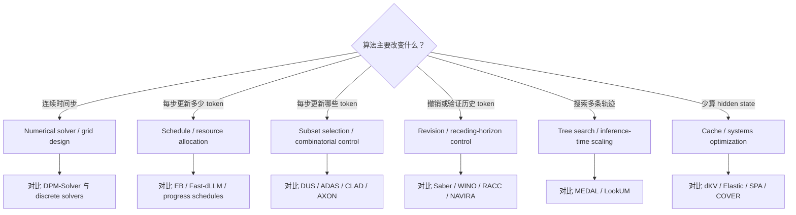
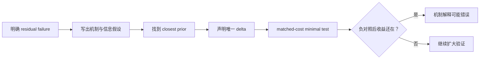

# DLM Discussion Guide for Math and OR Collaborators

## 讨论目标

不要从“我有一个更好的算法”开始争论 novelty。先共同确定对方解的是哪一个 diffusion、优化对象是什么、算法访问哪些信息、成本怎样计算，再与最近邻方法逐项对齐。

## 开场必须问的七个问题

1. 这里的 diffusion 是 continuous SDE/ODE、general discrete diffusion，还是 masked DLM decoding？
2. 输入状态和最终输出分别是什么？
3. 算法每一步可以采取什么动作：选 timestep、选 token subset、remask、branch，还是刷新 cache？
4. 优化目标是 NFE、真实延迟、p95、accuracy、perplexity，还是 sequence success？
5. 预算是硬约束、期望约束，还是 Lagrangian penalty？
6. 算法使用 confidence、entropy、attention、logit history、ground truth 还是额外模型？
7. 相比 EB-Sampler、DUS、Saber、Learned Policy、MEDAL、ADAS 和 COVER，唯一不同的机制是什么？

## 白板上的共同数学语言

| 元素 | masked DLM 中的定义 | 需要当场确认 |
|---|---|---|
| State `s_t` | partial canvas、mask set、scores、history、cache、remaining budget | 是否满足 Markov 性；历史怎样压缩 |
| Action `a_t` | commit/remask subset、compute mode、stop | 是单 token、block、cluster 还是任意 subset |
| Transition | 运行 DLM 后更新 canvas 与内部状态 | 是否随机；是否额外调用模型 |
| Reward/cost | terminal quality、latency、NFE、memory | 中间 proxy 与最终质量怎样对应 |
| Constraint | call budget、SLO、zero-mask completion、quality floor | 是 per-request 还是平均约束 |
| Observation | confidence、entropy、KL、attention、trajectory | 是否校准；是否会随任务/模型 shift |

## 先分类，再判断算法



## 四个可讨论的优化问题

### 1. Robust constrained control

```text
minimize_pi  E[latency]
subject to   P(task failure | task/model/length shift) <= alpha
```

真正的研究点不是换一个优化器，而是找到在 shift 下仍可校准的 failure observable，并证明或实证约束成立。

### 2. Tail-latency resource allocation

```text
minimize_pi  p95 latency
subject to   quality >= q0
```

需要把 remasking、extra forward、cache invalidation、batch interaction 和 controller overhead 都计入；只减少平均 NFE 不够。

### 3. Causal value of a token set

问的是 commit 集合 `U` 对未来可解性的边际影响，而不是当前 confidence。可用 confidence-matched intervention 检验 attention/KL proxy 是否真的携带因果信息。

### 4. Sequence-failure certificate

目标是给出 request-level 的风险上界或 calibrated coverage。若证书只在 token-level 成立，却不能预测整条推理链失败，就不能支持预算控制。

## 一项算法怎样才值得继续



最低实验合同：两种 open DLM、一个 unseen task/length、相同 NFE 和真实 wall-clock、p50/p95、明确 policy overhead，并对 load-bearing signal 做 permutation 或 replacement negative control。

## 讨论结束时应留下的五行

```text
Problem:
Closest prior:
Exact algorithmic delta:
Complexity and budget currency:
One experiment that can kill the claim:
```

已有 idea 与碰撞证据见 [[research/dlm/paper/legacy/ideas/index]]；完整 OR 映射见 [[research/dlm/reference/optimization-bridge]]。

