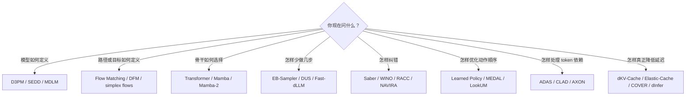

# DLM References

本目录只管理可复用的知识与来源，不放未经审计的新想法。

## 文献地图

| 页面 | 解决的问题 |
|---|---|
| [[research/dlm/reference/landscape]] | DLM 的数学骨架、模型谱系、推理方法分类和开放问题 |
| [[research/dlm/reference/transport-and-backbones]] | Flow Matching、Discrete Flow 与 Mamba/SSM 分别改变哪一层 |
| [[research/dlm/reference/optimization-bridge]] | 如何把 DLM decoding 翻译成运筹与优化对象 |
| [[research/dlm/reference/reading-list]] | 从基础到前沿的分层阅读顺序 |
| [[research/dlm/reference/search-log]] | 检索 query、来源覆盖、失败记录和时效性 |
| [[research/dlm/reference/papers/index]] | 25 组本地 PDF/提取文本及 canonical URL |

## 按问题找文献

## 本地材料规则

- `papers/<slug>.pdf` 是下载的原文。
- `papers/<slug>.txt` 是对应的 `pdftotext` 提取，仅用于检索与 passage-level 对照。
- 不手改提取文本；长期总结写入本目录的 Markdown 页面。
- 新论文进入本地库时，同步更新 [[research/dlm/reference/papers/index]] 和 [[research/dlm/reference/search-log]]。

返回 [[research/dlm/index]]。
